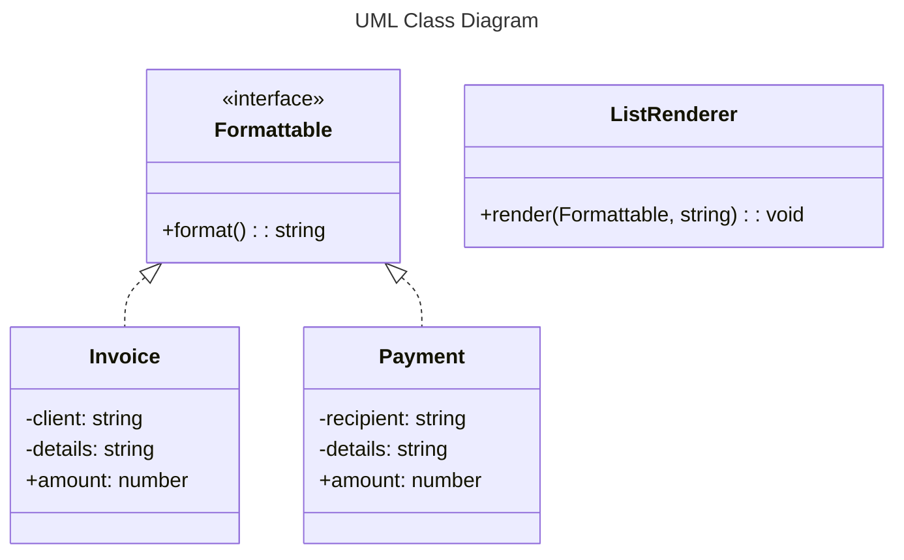

# Finance Logger
TypeScript web application. Created following The Net Ninja YouTube [tutorial](https://www.youtube.com/playlist?list=PL4cUxeGkcC9gUgr39Q_yD6v-bSyMwKPUI).

```mermaid
---
title: UML Class Diagram
---
classDiagram
    class Formattable{
        <<interface>>
        +format(): string
    }

    class Invoice{
        -client: string
        -details: string
        +amount: number
    }
    Formattable<|..Invoice

    class Payment{
        -recipient: string
        -details: string
        +amount: number
    }
    Formattable<|..Payment

    class ListRenderer{
        +render(Formattable, string): void
    }
```
